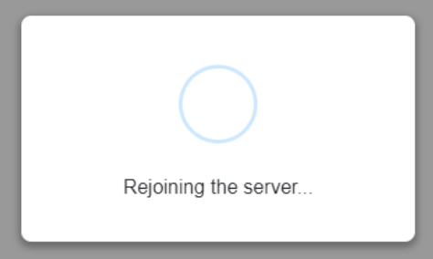

---
# You can also start simply with 'default'
theme: seriph
# random image from a curated Unsplash collection by Anthony
# like them? see https://unsplash.com/collections/94734566/slidev
background: https://cover.sli.dev
# some information about your slides (markdown enabled)
title: Welcome to Slidev
info: |
  ## Slidev Starter Template
  Presentation slides for developers.

  Learn more at [Sli.dev](https://sli.dev)
# apply unocss classes to the current slide
class: text-center
# https://sli.dev/features/drawing
drawings:
  persist: false
# slide transition: https://sli.dev/guide/animations.html#slide-transitions
transition: slide-left
# enable MDC Syntax: https://sli.dev/features/mdc
mdc: true
# open graph
# seoMeta:
#  ogImage: https://cover.sli.devf
---


<style>
.slidev-vclick-target {

  opacity: 0;
  transition: opactiy 0.3s ease;
}

.slidev-vclick-target.slidev-vclick-current,
.slidev-vclick-target.slidev-vclick-prior {
  opacity: 1;
}

.two-cols-header  {
  column-gap: 2rem;
}
</style>


# Mastering Blazor Rendering Modes

<div class="absolute bottom-4 right-4">

## Brett Huber

</div>


---


# About Me

<br />

<div class="grid grid-cols-2 gap-4">

<div class="flex flex-col  gap-4 text-xl">

Working in the software industy for 13 years in various differnt roles

- Product Owner
- Developer
- Solutions Architect

</div>

<div class="flex flex-col items-center gap-4">

<svg xmlns="http://www.w3.org/2000/svg" viewBox="0 0 24 24" data-supported-dps="24x24" fill="#0a66c2" class="mercado-match" width="96" height="96" focusable="false">
  <path d="M20.5 2h-17A1.5 1.5 0 002 3.5v17A1.5 1.5 0 003.5 22h17a1.5 1.5 0 001.5-1.5v-17A1.5 1.5 0 0020.5 2zM8 19H5v-9h3zM6.5 8.25A1.75 1.75 0 118.3 6.5a1.78 1.78 0 01-1.8 1.75zM19 19h-3v-4.74c0-1.42-.6-1.93-1.38-1.93A1.74 1.74 0 0013 14.19a.66.66 0 000 .14V19h-3v-9h2.9v1.3a3.11 3.11 0 012.7-1.4c1.55 0 3.36.86 3.36 3.66z"></path>
</svg>


</div>

</div>
<!--
Been working in the software industy for 13 years now in various differnt roles

- Product Ownder
- Developer
- Solutions Architect

Feel free to connect with me on Linked in

-->

---
layout: view-transition
---

<div class="grid grid-cols-1 grid-rows-1">
  
   {.view-transition-title}
</div>

<!--

People from hunter I see a few, but can you all raise your hands?

Fun fact - I believe we sent about X people here to this conference. so probablt about X% of people here are fron hunter.
If you havnt hear about hunter - we are a hidden gem in st louis.  
I have been tehre for 5 and a half years now.

We sell equipment to auto shops and dealershipts. Lift racks, tire balancers, tire changers, aligners.  

(NEXT SLIDE)

-->

---

 {.view-transition-title}


<div class="flex flex-col justify-center items-center mt-10 mb-10">

# Hiring - Scrum Master, Software Engineer I-III roles

</div>

<div class="flex flex-row justify-around">


</div>

<!--

- and we are hiring.
- have some postions open for Scrum master, Software Engineers 1 through 3.  
I would encourage you all to apply. Scan the QR code to see the hiring page.


-->

---
layout: header-single-col
---

# Blazor Experience 

::content::

<v-click>

<div class="flex flex-col gap-4 items-center">

# 3 years
# Blazor Hybrid (WPF)

</div>

</v-click>


<!--
- How many in here have experience with Blazor?
- How many then have actually shipped something to prooduction?


- Well my experience. Been working with it for around 3 years now
in a non traditional way. Using Blazor hybrid in desktop apps.

(CLICK)

- When hybrid was announced - we had a new project being started and we were evaluating what framework to use.
  - Past apps we have used electron with angular - but were not the biggest fans of it.  
    - NPM issues
    - and we write most of our other code in C# - so we would love to use one language if possible.
  - We evaulated blazor hybrid and ultimatley decided to go with it. - rendering the UI in a webview control inside a WPF shell.

- A few other teams hae started to use Blazor as a web app and have been successful with it.
-->

---
transition: view-transition
layout: section
---

# History of Blazor {.view-transition-title}

---

# History of Blazor {.view-transition-title}

<Timeline /> 


<!--
  - Before we dive into the modes, Want to give a brief history of balzor. As, I want to paint a picure of how what the ecosystem was like, and how it has progressed. 

  - [click] In 2017, Steve Sanderson developed demoed a new experimental framework called "Blazor"
     - initially his demo portrated an interactive web app written in C# that was compiled to Web Assembly running in the browser.
     - Funfact - according to Steve - the name blazor comes is a portmanteau of "browser" and "razor"

  - [click] In 2018 Microsoft announced it experimental support for it
  
  - [click] and with dotnet core 3.1 They released Blazor Server in 2019,
    - Going to be going over the full mental model of what Blazor server means in a differnt slide later, but essenttially. Everything lives on the server.  When a user visits a page. a signal-R connection is opened between the server and client.  When a button is clicked, that event is sent back via signal R. Server then compputs the event and sents the new html back via signal R.

  - [click] Next in 2020 they released blazor webassembly
    - Blazor web assemblu is where all C# code is compiled to WebAssembly (including runtime). that WASM bundle is then sent to the client.  all interacticions here happenin the client, running effectivly as a Single Page Application.
    - When I first heard of this - was really mind blown. Sure - the bundle size of this is high.  But the really cool thing here is that C# code is running locally on the client. No Javascript at all. 

  - It is imporant to note here that up until this poing when making a blazor project.  You had to choose up front if you wanted to run it in server or webassembly. 

  - [click] in 2022 - with the release of dotnet MAUI - Microsoft released Blazor hybrid.
    - This allowes you to run Blazor in a desktop or mobile app via a web view.
    - besides Maui - they also released webview controls for WPF and WinForms desktop apps. 
    - And that is what we use at Hunter - using WPF as shell, rendering the UI in the Webview control.

  - [click] That leads us to 2023 where with dotnet 8. Microsoft annouced what they were calling at the time "Blazor United"
    - Which was a complete overhaul of the blazor framework, which in my opinoin finally put blazor into the big leagues.
-->

---
transition: view-transition
layout: section
---

# Major changes with Blazor in .NET 8 {.view-transition-title}

---

# Major changes with Blazor in .NET 8 {.view-transition-title}

<div class="text-3xl">

<v-clicks>

1.  Static Server Side Rendering (Static SSR) of Pages.

1. No longer have to choose between Server or WASM up front.
   - Blazor can now be <span class="bg-yellow-800 p-1">progressively enhanced</span> - letting you mix and match between server and webassembly modes in the same project.when you need it

1. Performance improvements with Pre-rendering of elements on the server when it can.

</v-clicks>

</div>

<!--
- [click] Static Server Side Rendering (Static SSR) of Pages.

- [click] No longer have to choose between Server or WASM up front.
   - Blazor can now be <span class="bg-yellow-800 p-1">progressively enhanced</span> - letting you mix and match between server and webassembly modes in the same project.when you need it

- [click] Performance improvements with Pre-rendering of elements on the server when it can.
-->

---
layout: statement
---

# What is a Render Mode?

<v-click>

## How and where a component is rendered.

</v-click>

<!--

going to be using the term Render Mode a lot throughout this talk. 
  - So lets define what a render mode actually is. 

(CLICK)

- [click] The simple answer is - how and where a component is rendered.
    - These differnt modes effect interactivity, performance, and user experience.
-->
 
--- 

# Blazor Render Modes

<div class="h-full flex items-center">
  <div class="w-full grid grid-cols-1 md:grid-cols-6 gap-8">
    <div class="p-6 border border-solid rounded text-center text-2xl md:col-span-2">
      Blazor Hybrid
    </div>
    <div class="p-6 border border-solid rounded text-center text-2xl md:col-span-2">
      Static SSR
    </div>
    <div class="p-6 border border-solid rounded text-center text-2xl md:col-span-2">
      Interactive Server
    </div>
    <div class="p-6 border border-solid rounded text-center text-2xl md:col-start-2 md:col-span-2">
      Interactive WebAssembly
    </div>
    <div class="p-6 border border-solid rounded text-center text-2xl md:col-span-2 flex items-center justify-center">
      Interactive Auto
    </div>
  </div>
</div>

<!--
  - Here are the differnt render modes I am going to covering.in this talk
-->

---
transition: view-transition
layout: section
---

# Blazor Hybrid {.inline-block.view-transition-title}

<!--
  - The first one - blazor hybrid.  
  
  Not going to go to much detail in this one, as it really isn't web relataed - but it is still worth a mention.
  
  - As mentioned before - most of my experience utilzing blazor is in this mode via WPF desktop app that renders the UI in a webview control.
-->

---
transition: view-transition
---

# Blazor Hybrid {.inline-block.view-transition-title}

<div class="text-2xl space-y-4">

<v-clicks>

- lets you write razor components in desktop and mobile apps.
- components are rendered in a embded webview control runing __on the device__
- components have full access to native device capabilities through .NET Platform.
- Controls for:
  - .NET MAUI
  - WPF
  - WinForms

</v-clicks>

</div>

<!--
- [click] lets you write razor components in desktop and mobile apps.
- [click] components are rendered in a embded webview control runing __on the device__
- [click] components have full access to native device capabilities through .NET Platform.
- [click] Controls for:
  - .NET MAUI
  - WPF
  - WinForms
-->


---

# Blazor Hybrid


<div class="h-[55vh] w-full flex justify-end items-center">
  
</div>


<!--
 - Here is a visual explaining what I just spoke about
  - The platforms maui runs on - and the Razor componenst you run running in the WebView control
  - Now - you do have to be carefult with this.  As differnt platforms have differnt webview controls.  Windows isnt running the same webview as IOS - so it may have different capabilities.
  - In our case on the apps we work on - Window PC - we control the enviroment so the Edge Webview is evergreen - always up to date.
-->

---
transition: view-transition
layout: section
---

# Static Server Side Rendering (Static SSR) {.inline-block.view-transition-title}

---
transition: view-transition
layout: header-single-col
---

# Static Server Side Rendering (Static SSR) {.inline-block.view-transition-title}

::content::

<div class="text-4xl leading-12">
  
  Renders on the server - sending HTML to the client

</div>

<!--
  - Note that this is the default Render mode of a page, If you do not override it globally at the top router level.
 
 (NEXT SLIDE)
-->

---

<div class="grid [grid-template-rows:min-content_1fr] h-full"> 


# Static Server Side Rendering (Static SSR) {.inline-block.view-transition-title}


<div class=" mt-3 flex flex-row gap-8 items-center justify-center min-h-0">

  <div class="border-2 border-dashed border-gray-500 p-6 min-w-40  flex-1 h-full flex justify-center flex-col">
    <span class="flex-none self-center">Browser (Client)</span>
    <div v-click="2" class="flex flex-col items-center justify-center h-full">
      <span>&lt;div&gt;Hello World&lt;/div&gt;</span>
    </div>
  </div>

  <div class="flex flex-col items-center justify-center">
    <Arrow direction="right" label="Request (HTTP)" v-click="1" />
    <Arrow direction="left" label="Response (HTML)" v-click="2" />
  </div>

  <div class="border-2 border-dashed border-gray-500 p-6 min-w-40 text-center flex-1 h-full flex justify-center">
    <span>Server</span>
  </div>

</div>


</div>

<!--
- To get a better mental model of this, here I have a Brosswer on the Left, Server on the right
   
- [click] User Makes the HTTP request to the server
- HTML rendered on the server
- [click] then sent to the client


 - (Demo Counter Rendered static that it wont click)
     - As I demo this page - Note that on the network tag - when I hit refresh - just html is being servered.
     - The page loads quickly, and notice a no sort of weeb socket connection is being used. just html.

  - One thing to note with this mode, that as you can see when I click the counter on the button - nothign happens.
    - This is because Static SSR is not interactive. For interactivty you need to use one of the interactive modes.
    - Or if you need interactivity - you can also consider using the Html Form syntax.
-->

---

# Static SSR - <span class="text-white"> With Forms</span>

```csharp {all|5|7-12|9|11|16-17|}{maxHeight:'75vh'}
@page "/static-form"

....

<p>Your Name Is: @Name</p>

<form class="d-inline" data-enhance method="post" @formname="form" @onsubmit="SubmitForm">
    <AntiforgeryToken />
    <input type="text" @bind-value="@Name" name="Name" />

    <button class="btn btn-primary" type="submit">Submit</button>
</form>

@code {
    
    [SupplyParameterFromForm(FormName = "form")]
    public string Name { get; set; }

    private void SubmitForm()
    {
        Console.WriteLine($"Name: {Name}");
    }
}

```

<!--
- The code here shows a plain old Html form translated to razor syntax. 
- [click] You can see I have a Name field I am rendering (Underlline Name)
- [click] I declare an HTML form
- [click] My input is bound to the name property (Underlline Name input)
- [click] My Button is of typs submit (Underline Button)
- [click] Then the imporant part - my Name parameter is specified to be supplied from the form (underline name parameter)
- [click] When I click it it will submit the value in the input form. Callback will then print the value from the input.

  - Demo Form Submission
      - Now I am going to give a quick demo of form subbmission.
      - This can actually work as well with a counter component. but wanted to give a simple demo.
  - IF you need to submite some simple data - rather than immedietly jummping to an interactive mode - I woud recoment keeping it simple with the form method like this.

  - Demo Stream rendering blocking
    - I am going to show another example of static rendering that simulated a slow API call - just rendering a list of weather from the database.
    - You can see here when I click the page - nothing happens at first until all of the data is ready.  
      - Not an ideal user experience.
      - This is where stream rendering comes in 
      
    (Next Slide)
-->

---
transition: view-transition
layout: section
---

# Stream Rendering {.inline-block.view-transition-title}

---
transition: view-transition
layout: header-single-col
---

# Stream Rendering {.inline-block.view-transition-title}

::content::

<div class="text-4xl leading-12">

Sends initial HTML, then streams down the rest as it becomes ready.

</div>

<!--
  - This is where stream rendering comes in.
  - With streaming, the Server will generating what Html it can - sending it to the client
  - Then when data becomes ready - it will stream the Html down to the client
 
 (NEXT SLIDE)
-->

---

<div class="grid [grid-template-rows:min-content_1fr] h-full"> 

# Stream Rendering


<div class=" mt-3 flex flex-row gap-8 items-center justify-center min-h-0">

  <div class="border-2 border-dashed border-gray-500 p-6 text-center flex-1 h-full flex flex-col">
    <span class="mb-10">Browser (Client)</span>
    <div class="h-full flex flex-col justify-between">
      <div v-click="2" class="h-full flex flex-col">
          <span>&lt;div&gt;Hello World&lt;/div&gt;</span>
      </div>
      <div class="flex flex-col" v-click="5">
        <span>&lt;li&gt;Data 1&lt;/li&gt;</span>
        <span>&lt;li&gt;Data 2&lt;/li&gt;</span>
        <span>&lt;li&gt;Data 3&lt;/li&gt;</span>
      </div>
    </div>
  </div>

  <div class="flex flex-col items-center justify-around h-full">
    <Arrow direction="right" label="Request (HTTP)" v-click="1" />
    <Arrow direction="left" label="Initial HTML (static parts)" v-click="2" />
    <Arrow direction="left" label="Html Stream" v-click="4" />
  </div>

  <div class="border-2 border-dashed border-gray-500 p-6 min-w-40 text-center flex-1 h-full flex flex-col">
    <span>Server</span>
    <div class="h-full flex flex-row items-end justify-between">
      <div class="flex flex-col" v-click="['4', '5']">
        <span>Data 1</span>
        <span>Data 2</span>
        <span>Data 3</span>
      </div>
      <div class="flex flex-col items-end" v-click="3">
        <span>Database</span>
        <svg xmlns="http://www.w3.org/2000/svg" viewBox="0 0 448 512" width="60" height="60" fill="currentColor">
          <path d="M448 80l0 48c0 44.2-100.3 80-224 80S0 172.2 0 128L0 80C0 35.8 100.3 0 224 0S448 35.8 448 80zM393.2 214.7c20.8-7.4 39.9-16.9 54.8-28.6L448 288c0 44.2-100.3 80-224 80S0 332.2 0 288L0 186.1c14.9 11.8 34 21.2 54.8 28.6C99.7 230.7 159.5 240 224 240s124.3-9.3 169.2-25.3zM0 346.1c14.9 11.8 34 21.2 54.8 28.6C99.7 390.7 159.5 400 224 400s124.3-9.3 169.2-25.3c20.8-7.4 39.9-16.9 54.8-28.6l0 85.9c0 44.2-100.3 80-224 80S0 476.2 0 432l0-85.9z"/>
        </svg>
      </div>
    </div>
  </div>
</div>

</div>

<!--
- [click] The http request is sent to the server
- [click] An initial HTML page is sent to the client. What it can currently render
- [click] Data is requested from the database
- [click] When the data is ready it is streamed down to the client
- [click] then finally rendered on the client
-->

---

# Stream Rendering 
## Code Example

```csharp {|2|25-37}{maxHeight:'500px'}
@page "/stream-rendering"
@attribute [StreamRendering]

....

@code {
    private List<WeatherForecast> forecasts = [];

    protected override async Task OnInitializedAsync()
    {

        await Task.Delay(1000);

        var startDate = DateOnly.FromDateTime(DateTime.Now);
        var summaries = new[] { "Freezing", "Bracing", "Chilly", "Cool", "Mild", "Warm", "Balmy", "Hot", "Sweltering", "Scorching" };

        await foreach (var weather in GenerateForecastsAsync(startDate, summaries, 15))
        {
            forecasts.Add(weather);
            await Task.Delay(100); // Optional throttling to prevent overwhelming UI
            StateHasChanged();
        }
    }

    private async IAsyncEnumerable<WeatherForecast> GenerateForecastsAsync(DateOnly startDate, string[] summaries, int count)
    {
        for (int i = 0; i < count; i++)
        {
            yield return new WeatherForecast
                {
                    Date = startDate.AddDays(i),
                    TemperatureC = Random.Shared.Next(-20, 55),
                    Summary = summaries[Random.Shared.Next(summaries.Length)]
                };

        }
    }
}


```
<!--
  - Here is a code example of how to get implement stream rendering
  - (Highlight the stream rendering attribute click mose)
     - The most impporant thing being the stream rendering attribute
  - Then i just have an Async call here yielding data every .5 seconds
  - (Demo Stream Rendering Page)
  - And now if we look at what this looks like on the demo page, you can see Initial data is rendered
    - Then as the data becomes ready - streamed down to the client
    - Looking at the network tab you can see no other calls being make, the server is just returning html down
-->
---
transition: view-transition
layout: section
---

# Interactive Server {.inline-block.view-transition-title}

<!--
Next going to talk about Interactive Server
-->

---
transition: view-transition
layout: header-single-col
---

# Interactive Server {.inline-block.view-transition-title}

::content::

<div class="text-4xl leading-12">

All code <span class="bg-yellow-800 p-1">Rendered on server</span>. Interactivity managed through SignalR Connection.

</div>

<!--

All code <span class="bg-yellow-800 p-1">Rendered on server</span>. Interactivity managed through SignalR Connection.

-->


---

<div class="grid [grid-template-rows:min-content_1fr] h-full"> 

# Interactive Server {.inline-block.view-transition-title}

<div class="mt-3 grid grid-cols-5 grid-rows-3 min-h-0">

  <div class="col-start-1 col-end-3 row-start-1 row-end-4 border-2 border-dashed border-gray-500 p-6 text-center flex-1 h-full flex flex-col">
    <span class="mb-10">Browser (Client)</span>
    <div class="h-full flex flex-col justify-between">
    </div>
  </div>

  <div class="col-start-3 col-end-4 flex flex-col items-center justify-center">
    <Arrow direction="right" label="Request (HTTP)" v-click="1" />
    <Arrow direction="left" label="Response" v-click="2" />

  </div>

   <div v-click="3" class="col-start-2 col-end-5 row-start-2 row-end-4 border-2 border-dashed border-gray-500 p-6 text-center flex-1 h-full flex flex-col">
      <span class="mb-8">SignalR Connection</span>
      <div class="h-full grid grid-cols-3 grid-rows-2 gap-y-4">
        <span v-click="4" class="col-start-1 col-end-2 row-start-1 row-end-2 mr-5 border-2 border-gray-500 flex items-center justify-center">Button Clicked</span>
        <Arrow v-click="5" class="col-start-2 col-end-3 row-start-1 row-end-2" direction="right" label="SignalR Event Message" />
        <span v-click="6" class="col-start-3 col-end-4 row-start-1 row-end-2 ml-5 border-2 border-gray-500 flex items-center justify-center">Handle Button Click</span>
        <Arrow v-click="7" class="col-start-2 col-end-3 row-start-2 row-end-3" direction="left" label="Dom Diff of changes" />
        <div v-click="8" class="cold-start-1 col-end-2 row-start-2 row-end-3 mr-5 border-2 border-dashed border-gray-500 p-6 text-center flex items-center justify-center">Blazor.web.js</div>
      </div>
    </div>


  <div class="col-start-4 col-end-6 row-start-1 row-end-4 border-2 border-dashed border-gray-500 p-6 min-w-40 text-center flex-1 h-full flex flex-col">
    <span>Server</span>
    <div class="h-full flex flex-row items-end justify-between">
    </div>
  </div>
</div>

</div>


<!--

- [click] Initial HTTP Request is made
- [click] Response is sent back
- [click] A SignalR connection or Web socket connection is kept open between the client and the browser
- [click] So when a user clicks a button 
- [click] A Message is sent to the server via Signnal
- [click] the handler function is then ran on the server
- [click] a Dom diff of the UI changes is then sent to the client
- [click] Blazor.web.js then applies the UI changes to the DOM


- (Demo interactive server page)
    - Here is an example page.
      - If I open up the dev tools - you can see log web socket is open
        (Network Tab show web socket trafic )
      - On the network tab If I filter by the web socket
         - Then go to the Message tab, As I click the button you can see messages going back and forth between the browser and server
         - These are encoded binary messages.  Looked a buit into this and couldnt find any documentatin or utility on how to decode them to a readable state.
            - But essentially they contain instructions on how to update the Dom IE adding new elements, removing elements, updating attributes, etc...
    - Now if I navigate away from the page - you can see the web socket is closed.
    - TODO - When TO USE
-->

---
layout: header-single-col
---

# Interactive Server {.inline-block.view-transition-title}

::content::

<div class="text-4xl leading-12">

Each user is its own SignalR connection to the server

</div>

<!--

Each user is its own SignalR connection to the server

-->

---

# Interactive Server {.inline-block.view-transition-title}

<div class="flex flex-col justify-center items-center h-full text-center text-4xl">

Coupled to network performance

<br />



</div>

<!--

If a user is on poor 3g connection - their experience will suffer and they will see a notable lag between event roundtrip.

As well as if the connection is spotty - the signalR connection may be dropped or go in and out

-->

---
transition: view-transition
layout: section
---

# Interactive WebAssembly {.inline-block.view-transition-title}

<!--

Up Next is Interactive WebAssembly

-->

---
transition: view-transition
layout: header-single-col
---

# Interactive WebAssembly {.inline-block.view-transition-title}

::content::

<div class="text-4xl leading-12">

All code <span class="bg-yellow-800 p-1">Rendered on client</span>. C# Runs directly in the browser via WebAssembly.

</div>

<!--

All code <span class="bg-yellow-800 p-1">Rendered on client</span>. your C# code is running  directly in the browser via WebAssembly.

-->

---

<div class="grid [grid-template-rows:min-content_1fr] h-full"> 

# Interactive WebAssembly {.inline-block.view-transition-title}

<div class="mt-3 grid grid-cols-5 grid-rows-3 min-h-0">

  <div class="col-start-1 col-end-4 row-start-1 row-end-4 border-2 border-dashed border-gray-500 p-6 text-center flex-1 h-full flex flex-col">
    <span class="mb-5">Browser (Client)</span>
    <div class="h-full flex flex-row space-between gap-2" v-click="3">
      <div class="flex flex-col h-full border-1 border-dashed border-gray-500 p-2 w-1/2 gap-2">
        dotnet.wasm	
          <div class="flex flex-col border-1 border-dashed border-gray-500 justify-center h-1/4">
            .NET Runtime
          </div>
          <div class="flex flex-col border-1 border-dashed border-gray-500 h-3/4">
            Razor Components
        </div>
      </div>
      <div class="flex flex-col items-center justify-between">
        <Arrow direction="both" label="" />
        <Arrow direction="both" label="JS Interop"  />
      </div>
      <div class="flex flex-col h-full w-1/2 gap-3">
        <div class="flex flex-col border-1 border-dashed border-gray-500 h-3/4 p-2">
          DOM
          <div class="text-xs mt-2">
            <span>&lt;div&gt;Hello World&lt;/div&gt;</span>
            <span>&lt;button&gt;Click Me&lt;/button&gt;</span>
          </div>
        </div>
        <div class="flex flex-col border-1 border-dashed border-gray-500 justify-center h-1/4">
          blazor.webassembly.js	
        </div>
      </div>
    </div>
  </div>

  <div class="col-start-4 col-end-5 flex flex-col items-center justify-center">
    <Arrow direction="right" label="Request (HTTP)" v-click="1" />
    <Arrow direction="left" label="index.html Wasm Payload" v-click="2" />
  </div>

  <div class="col-start-5 col-end-6 row-start-1 row-end-4 border-2 border-dashed border-gray-500 p-6 min-w-40 text-center flex-1 h-full flex flex-col">
    <span>Server</span>
    <div class="h-full flex flex-row items-end justify-between">
    </div>
  </div>
</div>

</div>

<!--

- [click] Initial HTTP Request is made
- [click] Response is sent back which contains a WebAssembly bundle of the code to run
- [click] And here is overview of what the client is running
- There is a bridge between the WASN files running and the DOM
- All code Running now in the client.

-->

---
layout: header-single-col
---


# Interactive WebAssembly {.inline-block.view-transition-title}

::content::

<div class="text-4xl leading-12">

Data fetching done via web Api calls

</div>

<!--

Data fetching done via web Api calls


-->

---
layout: header-single-col
---


# Interactive WebAssembly {.inline-block.view-transition-title}

::content::

<div>
<div class="text-4xl leading-12">

Bundle size might be an issue

</div>

<div class="flex flex-col gap-4 justify-center items-center">

### - example app 7.MB compressed

### - lazy loading assemblies can help app startup time

</div>

</div>


<!--
Since we are essnentially sending a C# runtime over the wier compiled to web assembly.  
Running the app in Web assmebly could be an issue for you.

The Default app template compiled to web assembly with trimming turned on is 7.8mb compressed.

So that is 7.8mb files sent over the wire.

Note - This is the first hit. the WASM files are cached on subsequent visits.

Also - lazy loading can help with this - there are some ways to split up bundles for different pages so they are smaller.
- However that is something you have to setup and manage yourself.

-->


---
transition: view-transition
layout: section
---

# Interative Auto Rendering {.inline-block.view-transition-title}

<!--

The last render mode we are going to cover is Interactive Auto Rendering

-->


---

# Interactive Auto Rendering {.inline-block.view-transition-title}

<br />
<br />

<div class="text-3xl leading-12">

<v-click>

Combination of both Interactive Server and Web assembly

</v-click>

<br />

<v-clicks>

- Initial Request - <span class="bg-yellow-800 p-1"> **Interactive Server** </span>

- Background - Web Assembly bundle downloads and is cached

- Subsequent Vists - <span class="bg-yellow-800 p-1"> **Interactive Web Assembly** </span>

</v-clicks>

</div>

<!--
[click] This new mode is a combination of InteractiveServer and InteractiveWebAssembly.
- [click] On the initial render of the component, it renders on the server using InteractiveServer, keeping a web socket connection open.
- [click] In the background it is also sending the necessary WASM code to the client.
- [click] On Subsequent visits to the page, it will render Client Side via Web Assembly.
   
   - Demo AutoRender,

   - As you can see here on the network tab - intial render is Ineractive Auto. 
     - On th network tab you can see web socket open.
     - If I naviate away, web socket is closed. When I come back. render mode is web assembly.
     - On Any refresh of the page, - It still renders In Web Assemblhy.
-->

---
layout: header-single-col
---

# Interactive Auto Rendering {.inline-block.view-transition-title}

::content::

<div class="text-4xl leading-12">

Data fetched via web api calls*


<span v-click="1">

## *DI can change this

</span>

</div>


<!--
When fetching data for these - you will still need to do it via API calls.
- Reason being - on subsequent visits, application is loaded via cached WASM.  So it has no access to Database.

I Put an asterisk here - because there are some ways around this, but I am not sure if it they are worth the effort.

For example - via a your DI container you could solve by registering differnt services base on the interactivity mode.
-->

---

# Summary of Render Modes

<table>

<thead>
  <tr>
    <th>Name</th>
    <th>Description</th>
    <th>Render location</th>
    <th>Interactive</th>
  </tr>
</thead>

<tbody>

  <tr>
    <td>Static Server</td>
    <td>Static server-side rendering (static SSR)</td>
    <td>Server</td>
    <td>❌ No</td>
  </tr>

  <tr>
    <td>Interactive Server</td>
    <td>Interactive server-side rendering (interactive SSR) using Blazor Server.</td>
    <td>Server</td>
    <td>✔️ Yes</td>
  </tr>

  <tr>
    <td>Interactive WebAssembly</td>
    <td>Client-side rendering (CSR) using Blazor WebAssembly†.</td>
    <td>Client</td>
    <td>✔️ Yes</td>
  </tr>

  <tr>
    <td>Interactive Auto</td>
    <td>Interactive SSR using Blazor Server initially and then CSR on subsequent visits after the Blazor bundle is downloaded.</td>
    <td>Server, then client</td>
    <td>✔️ Yes</td>
  </tr>

</tbody>

</table>


<!--
Here is a summary of the render modes.  Took the table from microsofts documentation.  Thought it did a good job of explainig the thousand foot view of the modes.
-->

---
layout: section
---

# Setting up a new project

<!--
  - With dotnet 8 and these new render modes, microsft introdce a new template to configure everything.
  - I am going to demo it in Rider - but all the same options exist in Visual studio
  (Open Rider)
  - The new template is Blazor Web App. The old stand alone tempaltes for WebAssembly and Server still exist.
  - The first thing we need to select is the Render modes we want to include.
    - Note - just because you make one selection here - doesnt mean you ar elocked in. - you can add an alternative render mode later.
    (Go Over differnt options)
  - Next we need to select the Interactive location. 
    - This gives us an option to either globally set a default render mode we select above
      - Or we can choose to opt into the render modes and set the on a per page basis.
         - If you are unsure and want to explore - I would recomment per page, as you can always make it global down the road
      - I am gong to set global so I can show you where that gets set in the project.

  - Alright - now we have the template created.
  - You notices it created two projects - with one being labeled "Client"
    - This is because we selected webassembly as one of the render modes.
    - This may seem like a weird thing, and I am going to do my best to try and explain it.
    - Any razor component that you want to be rendered ad web assembly or interactive auto will need to be in this project. 
      - if you keep the compoment in the Server project it and specify it to render as web assembly, it will Not render that way
    - Reason being they want to put these in a seperate project as this is the web assemmbly bundle that will be shipped to the client, and it needs compiled ahead of time,
      - you dont want your whole server project to be sent to the client.
    - if you look at the project file - not the web assembly poject type, and the depencty on AspNetCore WebAssembly package.
  
  - Now back in the main server project - lets take a look at the Program.cs file.
    - there are calls in the builder to Add both Server and WebAssembly components
    - In the app section there are also calls to add the Render modes and the assembly reference to the Client project

  - If you remember I set this to be rendered globally. This is set in App.razor
    - if you look at the HeadOutlet and the Router we are explicetly passing as a parameter to the component for it to render as InteractiveAuto
      - Based on how render mode inheritance works - every child component which is essentially every page now will get rendered as interativve auto.
-->

---
transition: view-transition
layout: section
---

# Applying Render Modes across your application {.view-transition-title}

<!--
Since the differnet render modes can be mixed and matched - it is important to understand how we can apply them across our application.
-->

---
layout: two-cols-header
---

# Applying Render Modes across your application {.view-transition-title}

::left::

<div v-click="1">

## Component Definition

```csharp
@page "..."
@rendermode InteractiveServer
```

</div>

::right::

<div v-click="2">

## Component Instance

```csharp
<Counter @rendermode="InteractiveServer" />
```

</div>

<!--
  - [click] Component Definition 
     - In this strategy - in a .razor compoentn you specify the mode wit the rendermode attribute
     - This means anyim that componsne is used - it will inheeit that render mode
  - [click] Component Instance
     - In this strategy you are explicitly stting the rendermode parameter on the component instance. 

     When you setup your project and you choose a global render mode this is how they are actually setting the render mode. They set it on the router instance.  Then by defauly since everything is a child of the router - the whole app inherits it.
-->

--- 
layout: center
---


<div>

## Note - Component Authors should avoid coupling the definition to a specific render mode.

<br />

## <span class="bg-yellow-800 p-1" v-click="1">Components should be designed to support any render mode.</span>

</div>


<!--

Note - Component Authors should avoid coupling the definition to a specific render mode.

[click] Components should be designed to support any render mode.

 Ex: Say you are creating a re-usable button.  Do not define a render mode in the component definition.  Let the consumers of the component decide, by setting it in the component instance.
-->


--- 
layout: statement
---

# Render mode propagation and rules

<!--
  - In the next few slides I am going to go over some of the rules on how Render modes can be propagated down the component tree.
-->

---
layout: two-cols-header
---

# A component will inherit the render mode of its parent unless it is overriden.

::left::

```csharp
@page "/some-page"

<SomeComponent />
```

::right::

```csharp
@page "/some-page"
@rendermode InteractiveServer

<SomeComponent />
```


<!--
  A componnent will inheriret the render mode of its parent unless it is overriden.
  - So in these code examples.  On the left - Some component is rendered statically.
    - While on the right it would be rendered interactively, since the page specifies it.
-->

---
layout: two-cols-header
---

# <b>Interactive</b> rendered components children must share the same interactive mode

::left::

```csharp
@page "/some-page"
@rendermode InteractiveServer

<SomeComponent @rendermode="InteractiveWebAssembly" />
```

::right::


<div>

❌ Error:
Cannot create a component of type 
'BlazorSample.Components.SomeComponent' 
because its render mode 
'InteractiveWebAssemblyRenderMode' is not supported by Interactive Server rendering.

</div>

<!-- 
  - This means An Interactive Server component can not be a child of a Web Assembly component and Vise Versa.
  - In this code example here, I have a component being rendered interactively on the server.
    - The Child component specified with Web Assembly.
    - When I try and build - we get this error.
-->

---
layout: center
---

```csharp
@page "/some-page"

<SomeComponent @rendermode="InteractiveServer" />
<OtherComponent @rendermode="InteractiveWebAssembly" />
```

<!--
  Note - that that only applies to Interactive Modes.
  - Since the default render mode of a page is static.. that means that this example is allowed.
    - One component rendering as Server, while the other rendering in Web Assembly.
-->

---
layout: two-cols-header
---

# Parameters passed to an interactive child component from a Static parent must be JSON serializable. 

::left::

```csharp
@page "/render-mode-9"

<SomeComponent @rendermode="InteractiveServer">
    Child content
</SomeComponent>
```

::right::

<div>
❌ Error:

System.InvalidOperationException: Cannot pass the parameter 'ChildContent' to component 'SomeComponent' with rendermode 'InteractiveServerRenderMode'. This is because the parameter is of the delegate type 'Microsoft.AspNetCore.Components.RenderFragment', which is arbitrary code and cannot be serialized.
</div>

<!--
This means that you can't pass render fragments or child content from a Static parent component to an interactive child component.This means that you can't pass render fragments or child content from a Static parent component to an interactive child component.
- So if we tried to render this code here - we would get this error.

- There is a way around this though, by wrapping the component with child content in a wrapper compoment
  (Go to next slide)
-->

---
layout: two-cols-header
---

# WrapperComponent.razor:

::left::

```csharp
<SomeComponent>
    Child content
</SomeComponent>
```

::right::

```csharp
@page "/some-page"

<WrapperComponent @rendermode="InteractiveServer" />
```


<!--
  - The example here shows what I mean
-->


---
transition: view-transition
layout: section
---

# Pre-rendering {.inline-block.view-transition-title}

---

# Pre-rendering {.inline-block.view-transition-title}

<br />

<div  class="text-3xl">


<v-click>

- The server outputs the HTML UI of the page as soon as possible in response to the initial request, which makes the app feel more responsive to users.

</v-click>

<v-click>

- Prerendering is enabled by default for interactive components (InteractiveServer, InteractiveWebAssembly)

</v-click>

<v-click>

- If Desired - you can opt out of it on certain components
  ```csharp {v-click="1"}
  @rendermode @(new InteractiveServerRenderMode(prerender: false))
  ```
</v-click>

</div>

<!--
  - With the latest version - we also got performance improvements with prerendering
  - [click] The server will output Html as quickly as possible, increassing the First Contentful Paint (FCP)
  - [click] Prerendering is enabled by default for interactive components (InteractiveServer, InteractiveWebAssembly)
  - [click] If Desired - you can opt out of it on certain components

-->

---
layout: section
---

# Performance Improvements from Pre-rendering

<!--
  - Now I would like to demo to you all the actual speed inprovements yielded from pre-renedering
  - I am going to be comparining the lighthouse performacne scores of WebAssembly with and without pre-rendering

  (Start WebAssemblyNoPrerendering in Rider)
  (Start WebAssemblyrerendering in Reider)

  - Thse are just the standard sample pages - Showing random weather data throttled to simulate a loading delay.

  (Demo Each weather page on the site)

  (Compare the scores)
-->

---
transition: view-transition
layout: section
---

# Pre-rendering Gotchas {.inline-block.view-transition-title}

---
transition: view-transition
---


# Pre-rendering Gotchas {.inline-block.view-transition-title}


<div class="flex flex-col justify-center items-center h-full gap-8">

<span class="text-4xl">Deceiving Interactivity</span>

<div v-click="1">

  ```csharp {v-click="1"}
  <h2>Render Mode: @RendererInfo.Name</h2>

  <p role="status">Current count: @currentCount</p>

  <button class="btn btn-primary" @onclick="IncrementCount" disabled="@(!RendererInfo.IsInteractive)">
      Click me
  </button>
  ```

</div>

</div>


<!--
  - One potential downside of prerendering is the page might not be fully interative yet, meaning wasm is still initializing.
  - This can lead to a  poor user experience. 

  - (Turn on 3g throttling)
  - Demo page "pre-rendering-downside"

  - Going to now demo this - turning on 3g throttling so I can simulate the web assembly loading slowly.
    
  - When this page loads, the button looks ready to be clicked.
    - However as I spam click it, it isn't working.

  - To get around this issue, starting with dotNet 9 - the framework gave us some privitives we can use to see what the current rendering mode is.
    - Which you can see that I am actually showing that on the current page.
    - Based on this render info promative, we can then conditionally set attributes on the page based on the interatctivity. 
  
  (switch back to slide showing)

  - Switching back to the presentation, here is an example you an see based on the interactiviy of the current render mode, I am disabling the button.
    - I am also displaying the current render mode
  - Back to my demos - the here on this page you can see it in action
    - (Turn off 3g throttling)
-->

---

# Pre-rendering Gotchas {.inline-block.view-transition-title}

<div class="flex flex-col justify-center items-center h-full gap-4">

<div class="text-4xl">

Component State Initialized twice {.inline-block.view-transition-title}

</div>

<div v-click="1" class="text-2xl">

<h1>

PersistentComponentState {.inline-block.view-transition-title} 

</h1>

</div>

</div>

<!--

 - One downside of pre-rendering is by default state when the component is hydraded to an interactive mode after pre-rendering, the component is remounted re-running the full component lifecycle.

  (Demo Persistated State Page)

  - For example, If I go back to this mode that is rendering statically on the server during pre-rendering, when it hydrates on the Client in InteractiveWebAssembly. You may notice that the weather data changed.
  - This is because the component is assentially remounting on the client, causing the full lifecycle to run again.

  (Back to Slides)

  - Not the ideal experience in most cases - but there is a way to get around it.

  - With the PersistentComponentState service.
  - It is essentially a cache and using it when the component is then remounted, it looks for the data in the cache otherwise it will re-run it.

  (Next slide to Demo it)

-->

---

# Pre-rendering Gotchas {.inline-block.view-transition-title}

## PersistentComponentState


```csharp {|4|14-16|25|28-32|}{maxHeight:'500px'}
@page "/persisted-state"

@rendermode InteractiveWebAssembly
@inject PersistentComponentState ApplicationState

....

@code {
    private List<WeatherForecast> forecasts = [];
    private PersistingComponentStateSubscription persistingSubscription;
    protected override async Task OnInitializedAsync()
    {

         if (!ApplicationState.TryTakeFromJson<List<WeatherForecast>>(
            nameof(forecasts), out var resotoredForcast))
        {
            forecasts = _forecastService.GetForecasts();
        }
        else
        {
            forecasts = resotoredForcast!;
        }
     
        // Call at the end to avoid a potential race condition at app shutdown
        persistingSubscription = ApplicationState.RegisterOnPersisting(PersistForecasts);
    }

    private Task PersistForecasts()
    {
        ApplicationState.PersistAsJson(nameof(forecasts), forecasts);
        return Task.CompletedTask;
    }
}
```

<!--
 
  - Here is some code that shows how to use it.
    - Inject into the component the ApplicationState class
    - Next, check if the value exists
    - Then to hook it all up and persist it, Register a call back, then inside that callback, persist the state, persisting it as a Json object encrypyed

  (Demo Persisted StatePage)
-->

---

# [ExcludeFromInteractiveRouting] attribute

```csharp
@page "/some-page-i-want-to-render-statically"
@attribute [ExcludeFromInteractiveRouting]
```
<!--
  - Not going to go to much into detail with this.  
  - But - Say if you set your app globally to run in interactive mode.
  - There maybe a few pages though you want to render complegtely statically.
  - Adding this attribute will then get it to render statically.
-->

---
layout: statement
---

# Which render mode should you use?

<span v-click="1">

## Depends on what you are trying to build

</span>

<!--
Which render mode shold you use?

Well - like most things in Software developent. It depends.

This is something that I am still learning as well.

(NEXT SLIDE)
-->

---
layout: header-single-col
---

# Which render mode should you use?

::content::

<div class="flex flex-col gap-4 items-center">

# Content driven site?

# Simple Form type data?

<v-click>

<span class="bg-yellow-800 p-1">

## Static SSR

</span>

</v-click>


</div>


---
layout: header-single-col
---

# Which render mode should you use?

::content::

<div class="flex flex-col gap-4 items-center">

# Real time connectivity?
# Interativity with moderate users?

<v-click>

<span class="bg-yellow-800 p-1">

## Interactive Server

</span>

</v-click>

</div>

---
layout: header-single-col
---

# Which render mode should you use?

::content::

<div class="flex flex-col gap-4 items-center">

# Offline Mode?

# Highly Interactivity with lots of users?

<v-click>

<span class="bg-yellow-800 p-1">

## Interactive WebAssembly

</span>

</v-click>


</div>

---
layout: header-single-col
---

# Which render mode should you use?

::content::

<div class="flex flex-col gap-4 items-center">

# What about Interactive Auto?

<v-click>


## Web assembly apps where you are concerned about the startup time.

</v-click>

</div>

<!--
When should you use interactive auto?

- When doing my research for this talk, was trying to figure out this myself.  

(CLICK)

[click] I honestly dont have a good answer but what I have thought off is in the case where you are doing Client side rendering via Web assmebly, and you are wanting a Fast interactvity.

- In that case Auto might be a good option.  I would definatly sprinkle it in in certain pages to see if it is worth it as you wuld then have the server tax since the first connection is Ineractive Server.

If anyone has any thoughts on this - feel free to stop and share with me.

-->

---
layout: header-single-col
---

# Which render mode should you use?

::content::

## Dont forget about stream rendering 

<!--

Lastly - Dont forget about stream rendering. when you have those long queries that could be blocking the full page load - try and stream them down.

-->

---


# Questions?