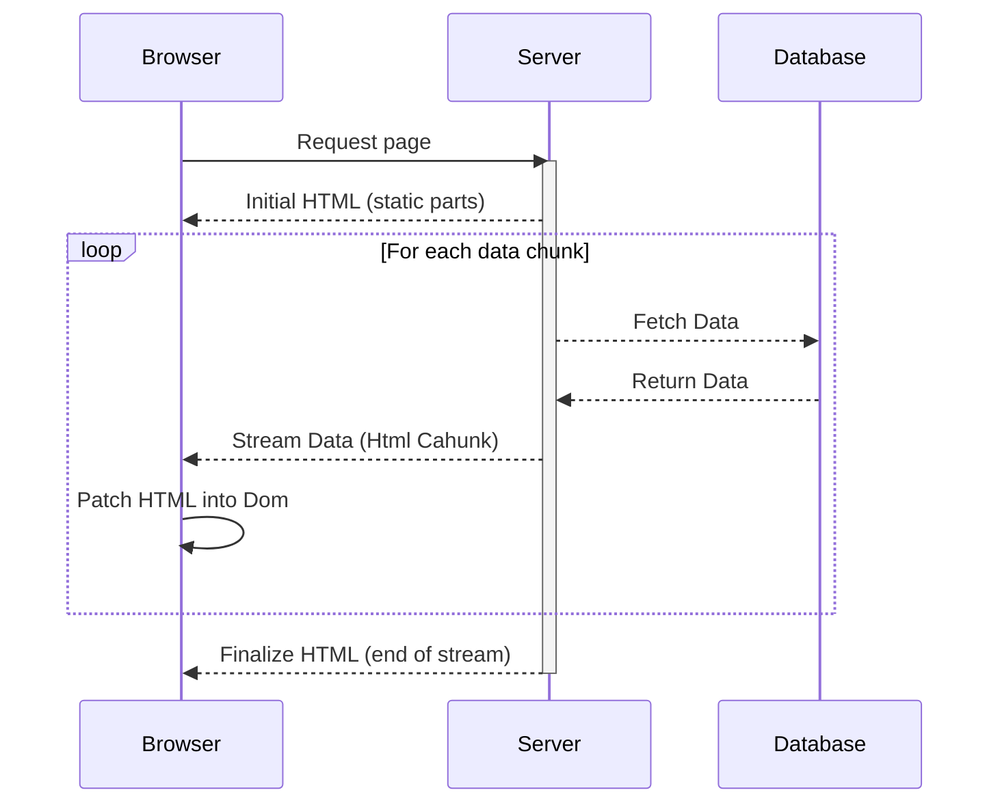
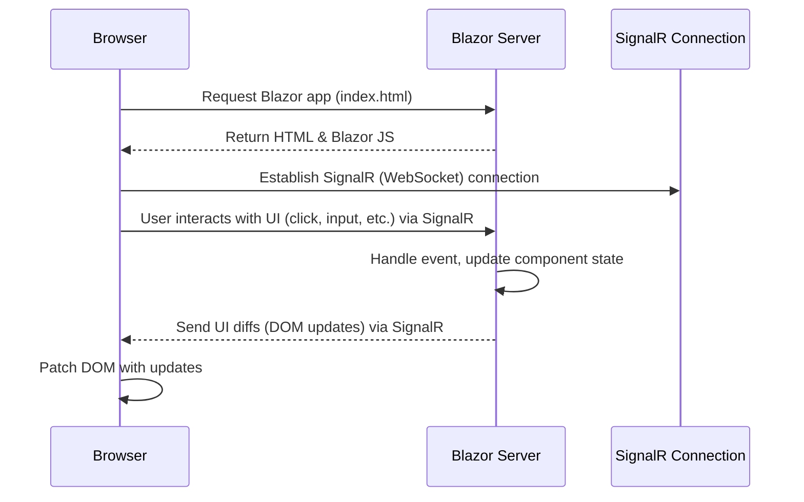
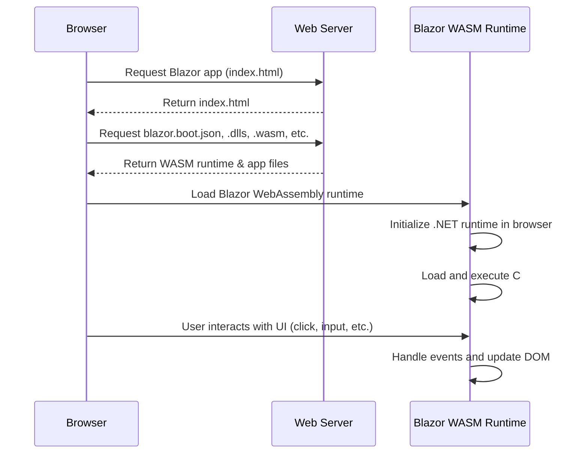
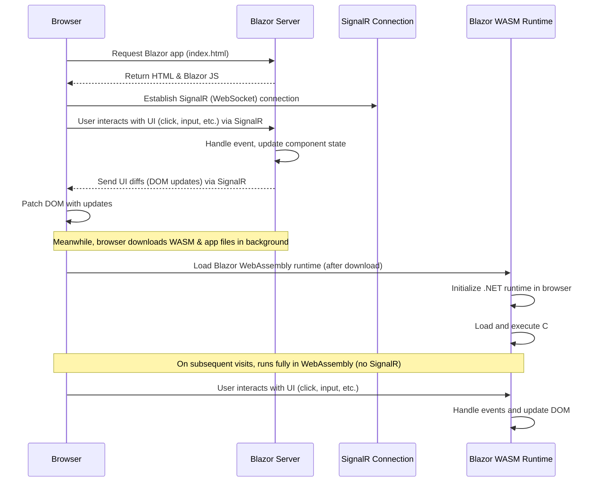

---
# You can also start simply with 'default'
theme: seriph
# random image from a curated Unsplash collection by Anthony
# like them? see https://unsplash.com/collections/94734566/slidev
background: https://cover.sli.dev
# some information about your slides (markdown enabled)
title: Welcome to Slidev
info: |
  ## Slidev Starter Template
  Presentation slides for developers.

  Learn more at [Sli.dev](https://sli.dev)
# apply unocss classes to the current slide
class: text-center
# https://sli.dev/features/drawing
drawings:
  persist: false
# slide transition: https://sli.dev/guide/animations.html#slide-transitions
transition: slide-left
# enable MDC Syntax: https://sli.dev/features/mdc
mdc: true
# open graph
# seoMeta:
#  ogImage: https://cover.sli.dev
---

# Mastering Blazor Rendering Modes

---


# About Me

---

# Blazor Experience 

---

# History of Blazor

<Timeline /> 


<!--
  - Before we dive into the modes, Want to give a brief history of balzor. As, I want to paint a picure of how what the ecosystem was like, and how it has progressed. 

  - In 2017, Steve Sanderson developed demoed a new experimental framework called "Blazor"
     - initially his demo portrated an interactive web app written in C# that was compiled to Web Assembly running in the browser.
     - Funfact - according to Steve - the name blazor comes is a portmanteau of "browser" and "razor"

  - In 2018 Microsoft announced it experimental support for it, and with dotnet core 3.1 They released Blazor Server in 2019,
    - Going to be going over the full mental model of what Blazor server means in a differnt slide later, but essenttially. Everything lives on the server.  When a user visits a page. a signal-R connection is opened between the server and client.  When a button is clicked, that event is sent back via signal R. Server then compputs the event and sents the new html back via signal R.

  - Next in 2020 they released blazor webassembly
    - Blazor web assemblu is where all C# code is compiled to WebAssembly (including runtime). that WASM bundle is then sent to the client.  all interacticions here happenin the client, running effectivly as a Single Page Application.
    - When I first heard of this - was really mind blown. Sure - the bundle size of this is high.  But the really cool thing here is that C# code is running locally on the client. No Javascript at all. 

  - It is imporant to note here that up until this poing when making a blazor project.  You had to choose up front if you wanted to run it in server or webassembly. 

  - in 2022 - with the release of dotnet MAUI - Microsoft released Blazor hybrid.
    - This allowes you to run Blazor in a desktop or mobile app via a web view.
    - besides Maui - they also released webview controls for WPF and WinForms desktop apps. 
    - And that is what we use at Hunter - using WPF as shell, rendering the UI in the Webview control.

  - That leads us to 2023 where with dotnet 8. Microsoft annouced what they were calling at the time "Blazor United"
    - Which was a complete overhaul of the blazor framework, which in my opinoin finally put blazor into the big leagues.
-->

---

# Major changes with Blazor in dotnet 8

<v-clicks>

1. Static Server Side Rendering (Static SSR) of Pages.
1. No longer have to choose between Server or WASM up front.
   - Blazor can now be <span class="bg-yellow-800 p-1">progressively enhanced</span> - letting you mix and match between server and webassembly modes in the same project.when you need it
1. Performance improvements with pre-rendering of elements on the server when it can.

</v-clicks>

<!--
  - Make Some componenst be server rendered, 
-->

---

# Setting up a new project

TODO 

---
layout: two-cols-header
---

# Applying Render Modes across your application

::left::

<div v-click="1">

## Component Definition

```csharp
@page "..."
@rendermode InteractiveServer
```

</div>

::right::

<div v-click="2">

## Component Instance

```csharp
<Counter @rendermode="InteractiveServer" />
```

</div>

<!--
  - Component Definition 
     - In this strategy - in a .razor compoentn you specify the mode wit the rendermode attribute
     - This means anyim that componsne is used - it will inheeit that render mode
  - Component Instance
     - In this strategy you are explicitly stting the rendermode parameter on the component instance. 

     When you setup your project and you choose a global render mode this is how they are actually setting the render mode. They set it on the router instance.  Then by defauly since everything is a child of the router - the whole app inherits it.
-->

--- 
layout: center
---


<div>

## Note - Component Authors should avoid coupling the definition to a specific render mode.

<br />

## <span class="bg-yellow-800 p-1" v-click="1">Components should be designed to support any render mode.</span>

</div>


<!--
 Ex: Say uou are creating a re-usable button.  Do not define a render mode in the component definition.  Let the consumers of the component decide, by setting it in the component instance.
-->

--- 

# TODO - Slide of differnt render modes

---

# Static Server Side Rendering (Static SSR)

- Renders on the server - sending Html to the client

<div class=" mt-3 flex flex-row gap-8 items-center justify-center h-[60vh] min-h-0">

  <div class="border-2 border-dashed border-gray-500 p-6 min-w-40 text-center flex-1 h-full flex justify-center">
    <span>Browser (Client)</span>
  </div>

  <div class="flex flex-col items-center justify-center">
  <Arrow direction="right" label="Request (HTTP)" v-click="1" />
  <Arrow direction="left" label="Response (HTML)" v-click="2" />
  </div>

  <div class="border-2 border-dashed border-gray-500 p-6 min-w-40 text-center flex-1 h-full flex justify-center">
    <span>Server</span>
  </div>

</div>


<!--
  - Note that this is the default Render mode of a page, If you do not override it globally at the top router level.
  - (Demo Counter Rendered static that it wont click)
     - As I demo this page - Note that on the network tag - when I hit refresh - just html is being servered.
     - The page loads quickly, and notice a no sort of weeb socket connection is being used. just html.
  - One thing to note with this mode, that as you can see when I click the counter on the button - nothign happens.
    - This is because Static SSR is not interactive. For interactivty you need to use one of the interactive modes.
    - Or if you need interactivity - you can also consider using the Html Form syntax.
-->

---

# Static SSR With Forms

```csharp
@page "/static-form"

.......

<p>Your Name Is: @Name</p>

<form class="d-inline" data-enhance method="post" @formname="form" @onsubmit="SubmitForm">
    <AntiforgeryToken />
    <input type="text" @bind-value="@Name" name="Name" />

    <button class="btn btn-primary" type="submit">Submit</button>
</form>

@code {
    
    [SupplyParameterFromForm(FormName = "form")]
    public string Name { get; set; }

    private void SubmitForm()
    {
        Console.WriteLine($"Name: {Name}");
    }
}

```

<!--
  - The code here shows a plain old Html form translated to razor syntax. 
      - You can see I have a NAme field I am rendering (Underlline Name)
      - My input is bound to the name property (Underlline Name input)
      - My Button is of typs submit (Underline Button)
      - Then the imporant part - my Name parameter is specified to be supplied from the form (underline name parameter)
      - When I click it it will submit the value in the input form. Callback will then print the value from the input.
  - Demo Form Submission
      - Now I am going to give a quick demo of form subbmission.
      - This can actually work as well with a counter component. but wanted to give a simple demo.
  - Demo Stream rendering blocking
    - I am going to show another example of static rendering that simulated a slow API call - just rendering a list of weather from the database.
    - You can see here when I click the page - nothing happens at first until all of the data is ready.  
      - Not an ideal user experience. (Next Slide)
-->

---

# Stream Rendering



<!--
  - This is where stream rendering comes in.
  - With streaming, the Server will generating what Html it can - sending it to the client
  - Then when data becomes ready - it will stream the Html down to the client
  - you can kind of see a graph of what I am talking about here
-->

---

# Stream rendering example

```csharp {|2|}
@page "/stream-rendering"
@attribute [StreamRendering]

....

@code {
    private List<WeatherForecast> forecasts = [];

    protected override async Task OnInitializedAsync()
    {

        await Task.Delay(1000);

        var startDate = DateOnly.FromDateTime(DateTime.Now);
        var summaries = new[] { "Freezing", "Bracing", "Chilly", "Cool", "Mild", "Warm", "Balmy", "Hot", "Sweltering", "Scorching" };

        await foreach (var weather in GenerateForecastsAsync(startDate, summaries, 15))
        {
            forecasts.Add(weather);
            await Task.Delay(100); // Optional throttling to prevent overwhelming UI
            StateHasChanged();
        }
    }

    private async IAsyncEnumerable<WeatherForecast> GenerateForecastsAsync(DateOnly startDate, string[] summaries, int count)
    {
        for (int i = 0; i < count; i++)
        {
            yield return new WeatherForecast
                {
                    Date = startDate.AddDays(i),
                    TemperatureC = Random.Shared.Next(-20, 55),
                    Summary = summaries[Random.Shared.Next(summaries.Length)]
                };

        }
    }
}


```
<!--
  - Here is a code example of how to get implement stream rendering
  - (Highlight the stream rendering attribute click mose)
     - The most impporant thing being the stream rendering attribute
  - Then i just have an Async call here yielding data every .5 seconds
  - (Demo Stream Rendering Page)
  - And now if we look at what this looks like on the demo page, you can see Initial data is rendered
    - Then as the data becomes ready - streamed down to the client
    - Looking at the network tab you can see no other calls being make, the server is just returning html down
-->

---

# Interactive Server



<div>
  Server
  <div>
    Dom
  </div>
  <div>
    Blazor.web.js
  </div>
</div>

TODO - Details on how patch is sent back to the client

<!--
  - Let know web socket  used to keep connection open
  - Demo interactive server page
    - let know when navigation away - web socket closed
    - TODO - When TO USE
-->

---

# Interactive WebAssembly

TODO - graph how how it works



---

# Interactive AutoRendering




<!--
  This new mode is a combination of InteractiveServer and InteractiveWebAssembly.
   - On the initial render of the component, it renders on the server using InteractiveServer, keeping a web socket connection open.
   - In the background it is also seding the necessary WASM code to the client.
   - On Subsequent visits to the page, it will render Client Side via Web Assembly.
   - Demo AutoRender,

   - As you can see here on the network tab - intial render is Ineractive Auto. 
     - On th network tab you can see web socket open.
     - If I naviate away, web socket is closed. When I come back. render mode is web assembly.
     - On Any refresh of the page, - It still renders In Web Assemblhy.
-->

---

# Persisting State between auto modes

```csharp {|4|14-16|25|28-32|}{maxHeight:'75vh'}
@page "/persisted-state"

@rendermode InteractiveWebAssembly
@inject PersistentComponentState ApplicationState

....

@code {
    private List<WeatherForecast> forecasts = [];
    private PersistingComponentStateSubscription persistingSubscription;
    protected override async Task OnInitializedAsync()
    {

         if (!ApplicationState.TryTakeFromJson<List<WeatherForecast>>(
            nameof(forecasts), out var resotoredForcast))
        {
            forecasts = _forecastService.GetForecasts();
        }
        else
        {
            forecasts = resotoredForcast!;
        }
     
        // Call at the end to avoid a potential race condition at app shutdown
        persistingSubscription = ApplicationState.RegisterOnPersisting(PersistForecasts);
    }

    private Task PersistForecasts()
    {
        ApplicationState.PersistAsJson(nameof(forecasts), forecasts);
        return Task.CompletedTask;
    }
}

<!--
  - One downside of automodes is, by default state is not persisted when the other mode kicks in
  - For example, If I go back to this mode that is rendering statically on the server during pre-rendering, when it hydrates on the Client in InteractiveWebAssembly. You may notice that the weather data changed.
  - This is because the component is assentially remounting on the client, causing the full lifecycle to run again.

  - To get around the this problem, Microsoft introduced the PersistentComponentState service.
  - You can think of it like a cache.

  - Here is some code that shows how to use it.
    - Inject into the component the ApplicationState class
    - Next, check if the value exists
    - Then to hook it all up and persist it, Register a call back, then inside that callback, persist the state, persisting it as a Json object encrypyed

  - Demo Persisted StatePage
-->

---

# TODO - Persisted state helper component


---

# TODO - Auto mode gotcha - slide/talk about what happens if you load from DB, then wasm loads

--- 
layout: statement
---

# Render mode propagation and rules

<!--
  - In the next few slides I am going to go over some of the rules on how Render modes can be propagated down the component tree.
-->

---
layout: two-cols-header
---

# A componnent will inheriret the render mode of its parent unless it is overriden.

::left::

```csharp
@page "/some-page"

<SomeComponent />
```

::right::

```csharp
@page "/some-page"
@rendermode InteractiveServer

<SomeComponent />
```


<!--
  A componnent will inheriret the render mode of its parent unless it is overriden.
  - So in these code examples.  On the left - Some component is rendered statically.
    - While on the right it would be rendered interactively, since the page specifies it.
-->

---
layout: two-cols-header
---

# <b>Interactive</b> renderd components children must share the same interactive mode

::left::

```csharp
@page "/some-page"
@rendermode InteractiveServer

<SomeComponent @rendermode="InteractiveWebAssembly" />
```

::right::


<div>
❌ Error:
Cannot create a component of type 'BlazorSample.Components.SomeComponent' because its render mode 'Microsoft.AspNetCore.Components.Web.InteractiveWebAssemblyRenderMode' is not supported by Interactive Server rendering.
</div>

<!-- 
  - This means An Interactive Server component can not be a child of a Web Assembly component and Vise Versa.
  - In this code example here, I have a component being rendered interactively on the server.
    - The Child component specified with Web Assembly.
    - When I try and build - we get this error.
-->

---
layout: center
---

```csharp
@page "/some-page"

<SomeComponent @rendermode="InteractiveServer" />
<SomeComponent @rendermode="InteractiveWebAssembly" />
```

<!--
  Note - that that only applies to Interactive Modes.
  - Since the default render mode of a page is static.. that means that this example is allowed.
    - One component rendering as Server, while the other rendering in Web Assembly.
-->

---
layout: two-cols-header
---

# Parameters passed to an interactive child component from a Static parent must be JSON serializable. 

::left::

```csharp
@page "/render-mode-9"

<SomeComponent @rendermode="InteractiveServer">
    Child content
</SomeComponent>
```

::right::

<div>
❌ Error:

System.InvalidOperationException: Cannot pass the parameter 'ChildContent' to component 'SomeComponent' with rendermode 'InteractiveServerRenderMode'. This is because the parameter is of the delegate type 'Microsoft.AspNetCore.Components.RenderFragment', which is arbitrary code and cannot be serialized.
</div>

<!--
This means that you can't pass render fragments or child content from a Static parent component to an interactive child component.This means that you can't pass render fragments or child content from a Static parent component to an interactive child component.
- So if we tried to render this code here - we would get this error.

- There is a way around this though, by wrapping the component with child content in a wrapper compoment
  (Go to next slide)
-->

---
layout: two-cols-header
---

# WrapperComponent.razor:

::left::

```csharp
<SomeComponent>
    Child content
</SomeComponent>
```

::right::

```csharp
@page "/some-page"

<WrapperComponent @rendermode="InteractiveServer" />
```


<!--
  - The example here shows what I mean
-->

---

# Prerendering

<v-clicks>

- The server outputs the HTML UI of the page as soon as possible in response to the initial request, which makes the app feel more responsive to users.
- Prerendering is enabled by default for interactive components (InteractiveServer, InteractiveWebAssembly)
- If Desired - you can opt out of it on certain components
  ```csharp {v-click="1"}
  @rendermode @(new InteractiveServerRenderMode(prerender: false))
  ```
</v-clicks>


<!--
  - With the latest version - we also got performance improvements with prerendering
  - The server will output Html as quickly as possible, increassing the First Contentful Paint (FCP)
-->

---
layout: center
---

# Performance Improvements from Pre-rendering

<!--
  - Now I would like to demo to you all the actual speed inprovements yielded from pre-renedering
  - I am going to be comparining the lighthouse performacne scores of WebAssembly with and without pre-rendering

  (Start WebAssemblyNoPrerendering in Rider)
  (Start WebAssemblyrerendering in Reider)

  - Thse are just the standard sample pages - Showing random weather data throttled to simulate a loading delay.

  (Demo Each weather page on the site)

  (Compare the scores)
-->

---

# Pre-rendering Gotchas

<div v-click="1">

  ```csharp {v-click="1"}
  <h2>Render Mode: @RendererInfo.Name</h2>

  <p role="status">Current count: @currentCount</p>

  <button class="btn btn-primary" @onclick="IncrementCount" disabled="@(!RendererInfo.IsInteractive)">
      Click me
  </button>
  ```

</div>

<!--
  - One potential downside of prerendering is the page might not be fully interative yet, meaning wasm is still initializing.
  - This can lead to a  poor user experience. 

  - (Turn on 3g throttling)
  - Demo page "pre-rendering-downside"

  - Going to now demo this - turning on 3g throttling so I can simulate the web assembly loading slowly.
    
  - When this page loads, the button looks ready to be clicked.
    - However as I spam click it, it isn't working.

  - To get around this issue, starting with dotNet 9 - the framework gave us some privitives we can use to see what the current rendering mode is.
    - Which you can see that I am actually showing that on the current page.
    - Based on this render info promative, we can then conditionally set attributes on the page based on the interatctivity. 
  
  (switch back to slide showing)

  - Switching back to the presentation, here is an example you an see based on the interactiviy of the current render mode, I am disabling the button.
    - I am also displaying the current render mode
  - Back to my demos - the here on this page you can see it in action
    - (Turn off 3g throttling)
-->

---

# [ExcludeFromInteractiveRouting] attribute

```csharp
@page "/some-page-i-want-to-render-statically"
@attribute [ExcludeFromInteractiveRouting]
```
<!--
  - Not going to go to much into detail with this.  
  - But - Say if you set your app globally to run in interactive mode.
  - There maybe a few pages though you want to render complegtely statically.
  - Adding this attribute will then get it to render statically.
-->

---

# When to use which mode

---

# Slide on example of how you can swap render data on server, then swap component to render WASM to sort it
